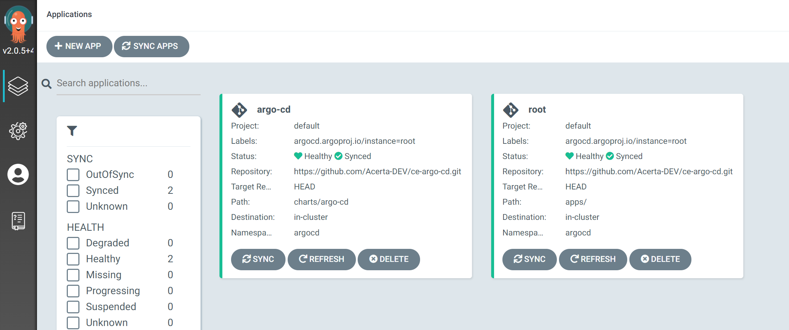

# ce-argo-cd

Purpose:
* Sets up ArgoCD in self-management mode i.e. ArgoCD will manage itself as any other application that it can manage
* Also contains a Dockerfile with a couple of standard CLI-tools to access an AKS cluster, `kubectl`, `helm`, argocd cli, etc 
  
At this moment the azure cli (az) cannot be installed on a standard Acerta laptop. 
Also, when dealing with multiple clusters and/or azure/aks-accounts at the same time, it is often safer/handier to run the CLI in a separate container so that the 'standard' .kube/config (containing most probably a special okteto-user/account) on the main laptop-host is preserved.

## Dockerfile with CLI tools

The following build and then pushes to DockerHub (docker.io). Of course, you should use your own DockerHub account (or don't push).

```bash
docker build -t cbonami/ce-aks-cli .
docker tag cbonami/ce-aks-cli cbonami/ce-aks-cli:latest
docker push cbonami/ce-aks-cli:latest
```
Then run it, while mounting the root folder of this project in the container's workdir:
```bash
# linux or powershell
docker run -it -v ${PWD}:/workdir cbonami/ce-aks-cli
# windows CMD.exe
docker run -it -v %cd%:/workdir cbonami/ce-aks-cli
```

On your host machine, point your browser to Azure portal (https://portal.azure.com) and retrieve AKS connect info from the right AKS-cluster. 
Click on the right cluster and in the 'Overview'-tab, you click 'Connect'.

Inside container, log in to Azure and AKS:

```bash
# login to your azure account
az login
    
# see Overview tab of AKS cluster (Connect-button)
az account set --subscription 1824decd-b137-4338-897f-e349d0c52e81
az aks get-credentials --overwrite --resource-group rg-ace-devtst-okteto --name aks-ace-devtst-okteto --admin

# verify
k get nodes
```

## ArgoCD Installation

```bash
# determine latest version of argocd chart
# chart docs here: https://github.com/argoproj/argo-helm/tree/master/charts/argo-cd
helm repo add argo-cd https://argoproj.github.io/argo-helm
helm dep update charts/argo-cd/
helm search repo argocd

# !! change versions of chart (in Chart.yaml) and image (in values.yaml)

# install a secret with a base64 encoded personal access token (github)
# this secret will be referred by repositories section in values.yaml (see ./charts/argo-cd)
# plz note that ssh-keys with passphrase are apparently not supported yet; this rules out the ssh-based approach,
# because Acerta enforces SSO, which enforces SSH with passphrase
echo cbonami | base64
Y2JvbmFtaQo=
echo ghp_... | base64
Z2hwX0tuM2N...

cat <<EOF | kubectl create -n argocd -f -
apiVersion: v1
kind: Secret
metadata:
  name: acerta-dev-repo-pat
  namespace: argocd
type: Opaque
data:
  username: <base64 encoded github username>
  password: <base64 encoded github PAT>
EOF

# https://www.arthurkoziel.com/setting-up-argocd-with-helm/
kubectl create ns argocd
helm install -n argocd argo-cd charts/argo-cd/

# open it up to the internet
kubectl apply -f ingress.yaml
```
Note the following tuning for ArgoCD:
* `installCRDs` is set to false. This is required when using Helm v3 to avoid warnings about nonexistant webhooks
* The Helm chart defaults to Argo CD version x.y.z. To use the latest version we bump global.image.tag to 2.0.5
* We disable the dex component that is used for integration with external auth providers
* We start the server with the `--insecure` flag to serve the Web UI over http (see option 2 in [https://argoproj.github.io/argo-cd/operator-manual/ingress/](https://argoproj.github.io/argo-cd/operator-manual/ingress/))

```bash
# recover credentials for user 'admin'
kubectl -n argocd get secret argocd-initial-admin-secret -o jsonpath="{.data.password}" | base64 -d
```

Point browser to [https://argocd.okt.global.dns/](https://argocd.okt.global.dns/)

Deploy root app:
```bash
helm template apps/ | kubectl apply -n argocd -f -
```



> Note: I had to push the 'Refresh' button to get rid of the health-status 'Processing'

As you can see in the dashboard, the root app also contains an application for ArgoCD itself. I.e. ArgoCD manages itself. So we can delete it from helm:

```bash
kubectl delete secret -n argocd -l owner=helm,name=argo-cd
```

Plz note that ALL management of ArgoCD, like adding git/helm repositories etc, needs to be done via the argo-cd chart, more precisely, the [values.yaml](charts/argo-cd/values.yaml) of that chart.

## Secret Management

For the time being, I've chosen [Bitnami Sealed Secrets](https://github.com/bitnami-labs/sealed-secrets). It's a kubernetes controller (CRD), just like ArgoCD is.
It is installed by ArgoCD as an [standard ArgoCD Application pointing to the official helm chart for `sealed-secrets`](./apps/templates/sealed-secrets.yaml).

It allows use to manage our Secrets also in git, just like any other k8s resource.
We encrypt your Secret into a SealedSecret, which is safe to store - even to a public repository. 
The SealedSecret can be decrypted only by the controller running in the target cluster and nobody else (not even the original author) is able to obtain the original Secret from the SealedSecret.
But we can [backup Sealed Secrets](https://github.com/bitnami-labs/sealed-secrets#how-can-i-do-a-backup-of-my-sealedsecrets).

## Helm repo by GitHub

We [turned GitHub into a Helm Repository](https://harness.io/blog/devops/helm-chart-repo/) using the [Github Releaser Action](https://helm.sh/docs/howto/chart_releaser_action/#github-actions-workflow).
The GitHub repo is [https://github.com/Acerta-DEV/ce-helm-charts](https://github.com/Acerta-DEV/ce-helm-charts).
This corresponds to a Helm Repo on `github.io` that you can add:
```bash
helm repo add ce-helm https://acerta-dev.github.io/ce-helm-charts
```
To install a chart:
```bash
helm install my-<chart-name> ce-helm/<chart-name>
```
To uninstall the chart:
```bash
helm delete my-<chart-name>
```

## Container Registry by GitHub

GitHub offers a Container Registry (ghcr.io). More info [here](https://docs.github.com/en/packages/working-with-a-github-packages-registry/working-with-the-container-registry
).

```bash
echo "ghp_****" | docker login ghcr.io -u <you> --password-stdin
docker push ghcr.io/OWNER/IMAGE_NAME:latest
```